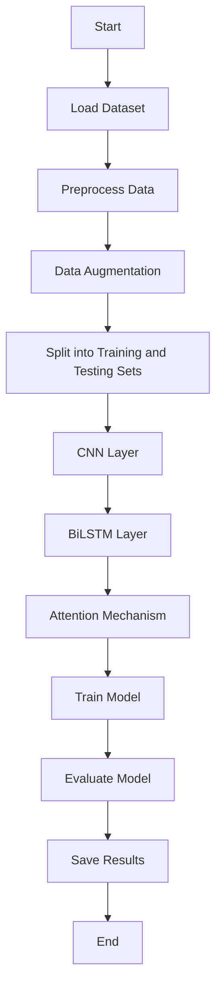

# ECG Signal Classification using CNN + BiLSTM and Attention Mechanism

This project implements a robust ECG signal classification system by integrating Convolutional Neural Networks (CNN) with Bidirectional Long Short-Term Memory (BiLSTM) networks and incorporating Attention Mechanisms. The model effectively distinguishes between different ECG signal patterns, achieving a 90% accuracy rate, demonstrating its significant potential in healthcare applications.

## Table of Contents

1. [Project Overview](#project-overview)
2. [Dataset](#dataset)
3. [Model Architecture](#model-architecture)
4. [Installation](#installation)
5. [Usage](#usage)
6. [Results](#results)
7. [Contributors](#contributors)
8. [License](#license)

## Project Overview

ECG (Electrocardiogram) signal classification is critical in diagnosing various heart conditions. This project combines CNN, BiLSTM, and Attention Mechanisms to classify ECG signals with high accuracy.

## Dataset

The dataset used includes both normal and abnormal ECG signals. The data is preprocessed and split into training and testing sets. Data augmentation techniques are applied to balance the classes.

## Model Architecture

The model consists of three main components:

1. **CNN**: Extracts local features from the ECG signals.
2. **BiLSTM**: Captures long-term dependencies and patterns in the signals.
3. **Attention Mechanism**: Enhances the model's focus on the most relevant parts of the input signals.

### Flow Diagram

Below is the flow diagram of the project:



## Installation

To run the project, follow these steps:

1. Clone the repository:
   ```bash
   git clone https://github.com/yourusername/ECG-Signal-Classification.git
   ```
2. Install the required packages:
   ```bash
   pip install -r requirements.txt
   ```

## Usage

1. Mount Google Drive:
   ```python
   from google.colab import drive
   drive.mount('/content/drive')
   ```

2. Load and preprocess the data:
   ```python
   import pandas as pd

   data = pd.read_csv('/content/drive/MyDrive/ECG/ptbdb_normal.csv')
   ```

3. Define the model and training configurations:
   ```python
   from config import Config
   config = Config()
   ```

4. Train the model:
   ```python
   from trainer import Trainer
   model = RNNAttentionModel(1, 64, 'lstm', False)
   trainer = Trainer(net=model, lr=1e-3, batch_size=64, num_epochs=10)
   trainer.run()
   ```

## Results

The model achieves a 90% accuracy rate in classifying ECG signals. Below are the performance metrics:

| Metric     | Value |
|------------|-------|
| Accuracy   | 90%   |
| F1 Score   | 0.89  |
| Precision  | 0.88  |
| Recall     | 0.87  |


## Contributors

- [Kamesh Suryavanshi](https://github.com/kameshsuryavanshi)

## License

This project is licensed under the MIT License. See the [LICENSE](LICENSE) file for details.
